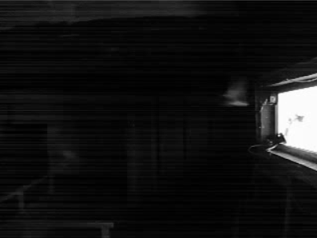
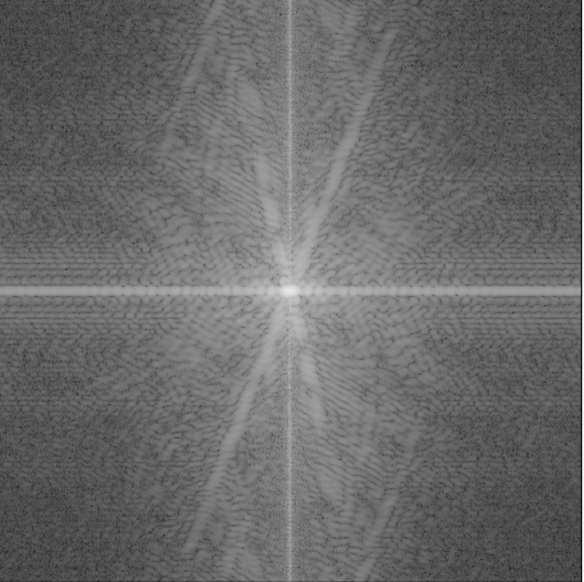
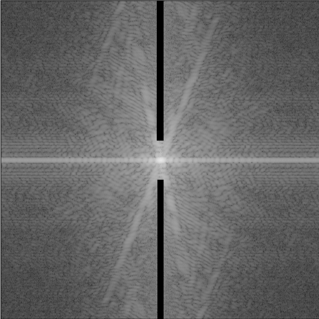
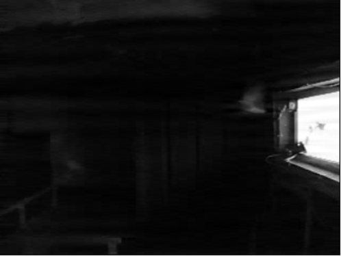

# Flight Of Swallows

## Introduction

## Process
### Noise Removal
Image from the pi camera can sometimes be noisy due to the unstable power supply of the bird house. This can distort the bird counting algorithm and produce inaccurate results.

Below is a snapshot of a typical noisy image. Notice the horizontal lines that appear through out the image, since it is almost systematically produced, it can be effectively removed(reduced) using in the FT(Fourier Transform) space.

The image after FT. Since noise arise from horizontal lines in the spacial space, the same noise will appear as a vertical line in the frequency space. Removing the main vertical line in the frequency space can effectively remove the horizontal noise in the spacial domain. 

Vertical line removed in the FT space.

Inverse transform of the above image will produce image below. Even though the thick line remains, the high frequency horizontal line disappears.

